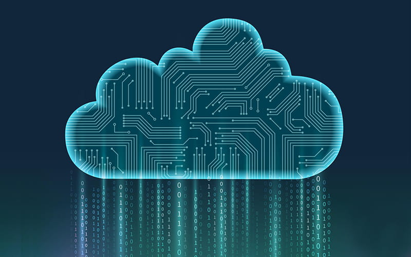
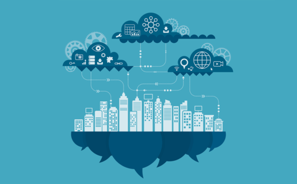
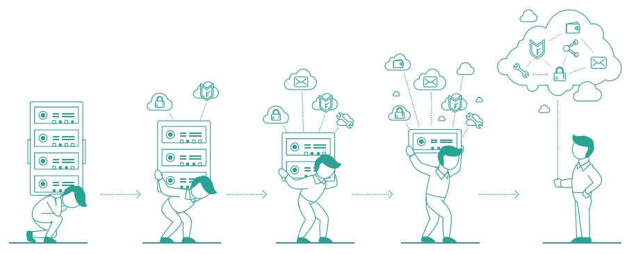
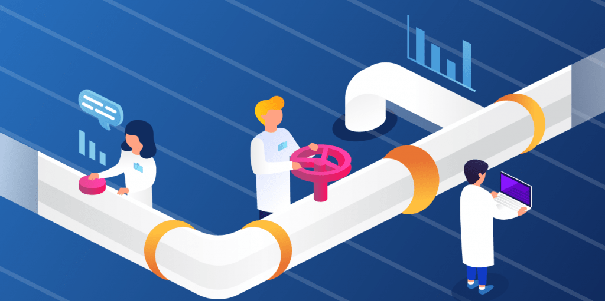

# Data Engineering Pipelines Overview and Cloud Providers

In this lesson we will take a look to **cloud computing** vs **on-premise servers** and how the data engineering **pipelines** have evolved with the help of cloud technologies.

What you will learn:

- Benefits of Cloud Computing for Data Engineering
- Cloud and On-Prem comparison
- Evolution of Data Engineering Pipelines with Cloud Computing
- Types of data pipelines

## Benefits of Cloud Computing for Data Engineering

### Scalability

>**Scalability**: Ability to efficiently and dynamically expand or shrink computing resources and infrastructure to meet changing demands and workloads.

#### Scenario - Scalability

*You work at Walmart as Data Engineer, you expect receive all the sales data at the **end of day**.*

How would you handle this schedule using cloud computing?

#### Solution - Scalability

- Setup contains minimal RAM to do health checks and CPU cores
- Set some rules:
  - When CPU usage is over 90% for more than 1 minute add 1 extra core
  - When CPU usage is below 50% for more than 1 minute remove 1 core
  - When RAM usage is over 90% for more than 1 minute double the RAM amount
  - When RAM usage is below 45% for more than 1 minute halve the RAM

>You need to be careful when scaling dinamically, if you don't set maximum and minimum it can decrease efficiency on your solution or go out of budget very easily.
>
>Do you have other solution? What is the minimum/maximum RAM and CPUs you will set for this solution and why?

#### Still curious - Scalability

- **Horizontal** and **Vertical Scaling** and when you use one or other?
- What other **policies** or **events** exists that can trigger a scalability change?

### Cost Savings

There are some key aspects of having a dedicated purchased server that may help reduce costs:

- You need no upfront hardware purchases
- You only pay for what you consume
- You can scale up/down based on demands
- Some services such as Lambda or Cloud Functions are self managed

#### Cost Savings - scenario

You are in charge of processing incoming events from IoT devices (Door, Motion, Temperature sensors...), this events can be delivered using a **streaming** such as Pub/Sub, inserting into Database, posting to API...

How will you setup your cloud infrastructure to save costs compared to a on-premise server?

#### Cost Savings - Solution

- Create a queue using Kinesis or Pub/Sub
- Setup a lambda or cloud function to process a single event
- Link the stream to Lambda
- Set scalability for the lambda

#### Cost Savings - Still curious

Why Microservices worked fine for amazon, uber but not for netflix?

- Article: [Why and How Netflix, Amazon, and Uber Migrated to Microservices: Learn from Their Experience][migrated to microservices]
- Article: [Reduce costs by 90% by moving from microservices to monolith: Amazon internal case study raises eyebrows][from microservices to monolith]

### High Availability

>**High Availability**: Ability of a system/infrastructure to remain operational for a high % of the time, usually 99.99% of the time.

High availability must be keeped regardless of maintenance, upgrades, hardware, software or even network failures.

#### Scenario - High Availability

You have a system that receives 911 data from real time calls, the source calls your API once then if fails will call the API again on the next 20 seconds then the information is lost.

Assuming you have a cloud Docker API to receive this data and you save it to cloud storage ensure app and storage are up 99.99% of the time.

#### Solution - High Availability

App:

- Setup deploying blue/green, canary...
- Setup multicontainer environment (kubernetes)
- Ensure healthcheck endpoint is verified every minute
- Setup network failover to mirror site (duplicate network on other cloud provider/other region from same provider)
- Setup scalability
- Use load balancer to ensure traffic is distributed evenly

Storage:

- Ensure redundancy is setup

#### Sill Curious - High Availability

- Is it too good to be true? What downside(s) can be observed when trying to keep high availability?
- What is an SLA? and Why is it so important?
- Investigate other deployment techniques to minimize downtime

### Global Accessibility

>**Global Accessibility**: Since cloud providers have global presence we can use that to our advantage

#### Scenario - Global Accessibility

You have an app that relies heavily on images, currently they are now stored in your company server.

Since the app is used globaly, how can you ensure optimal loading times for all users?

#### Solution - Global Accessibility

You may want to consider using Content Delivery Network on cloud storage

#### Sill Curious - Global Accessibility

- What are the advantages of CDN's?
- Can we solve this problem with data duplication?

### Disaster Recovery

>**Disaster Recovery**:  or Disaster Recovery Protocol (DRP), is the ability to recover from a disruption of any type.

#### Scenario - Disaster Recovery

Imagine you work at a national bank, havin hundred thousands of operations per second.

Assume your Database is in cloud, What measurements can you take in case of Database:

- Network failure
- Network attack (DDOS...)
- Record corruption

#### Solution - Disaster Recovery

- Network failure
  - Have an alternative access to internet, alternative VPN/VPC
  - Database mirroring failover
  - Master/Slave swap for alternative internet access
- Record corruption
  - Restore Database
  - Database mirroring failover

#### Sill Curious - Disaster Recovery

- Have you ever been on a DRP's practice or real scenario?
- Have you ever heard about Chaos Engineering?
- Does SLA's are important when designing DRP's? Why?
- Should we consider natural disasters or events like: bomb attacks in DRP?

### Rapid Provisioning and Deployment

>**Provisioning**: Setting up and allocating resources, services, or infrastructure components to meet the needs of an application, system, or user.

Some cloud services offer either CLI or UI to easy create and manage resources, this means you can create whole systems with just a few steps.

### Orchestration

>**Orchestration**: Automated coordination and management of multiple tasks, processes or services to achieve an specific output.

#### Scenario - Automation and Orchestration

You need to create a data pipeline extracting from multiple sources, each data may have dependencies on the product catalog, which you have available via Database, however you must handle errors in a different repository to return to each customer on a log file.

- What are the general considerations you have over this?

#### Solution - Automation and Orchestration

- **reading from multiple sources**: By reading from multiple sources you may want to consider different trigger/schedule
- **dependencies on the product catalog**:Depending on the source you may want to have different initial steps to fill initial data to have it normalized
- **error handling**: Save logs on a individual file for each record/request/file... if record could not be processed put the file log into a cloud storage
- Dump records into the final OLAP database

#### Sill Curious - Automation and Orchestration

- What is the name of the process described above?
- What other orchestrators you know?
- Did you ever heard about CI/CD
- Why is it so important orchestration is automated?

### Integration with Data Services

Integration with data services means we don't need to configure everything from scratch but also means on every platform they could be specialized services that help us further.

#### Exercise - Integration with Data Services

Complete the chart:

| On-Premises Service      | AWS Equivalent           | GCP Equivalent           |
|-------------------------|--------------------------|--------------------------|
| Data Warehouse           | | |
| Hadoop Ecosystem         | | |
| Relational Database      | | |
| NoSQL Database           | | |
| ETL Tool                 | | |
| Data Integration Tool    | | |
| Message Queue            | | |
| Object Storage           | | |
| File Storage             | | |
| Data Lake                | | |
| Workflow Orchestration   | | |
| Analytics and BI         | | |
| Real-time Streaming      | | |

#### Solution - Integration with Data Services

| On-Premises Service      | AWS Equivalent           | GCP Equivalent           |
|--------------------------|--------------------------|--------------------------|
| Data Warehouse           | Amazon Redshift          | BigQuery                  |
| Hadoop Ecosystem         | Amazon EMR               | Google Dataproc           |
| Relational Database      | Amazon RDS               | Google Cloud SQL         |
| NoSQL Database           | Amazon DynamoDB          | Google Cloud Firestore   |
| ETL Tool                 | AWS Glue                 | Cloud Dataflow            |
| Data Integration Tool    | AWS Data Pipeline        | Cloud Composer            |
| Message Queue            | Amazon SQS               | Cloud Pub/Sub             |
| Object Storage           | Amazon S3                | Google Cloud Storage     |
| File Storage             | Amazon EFS               | Google Cloud Filestore   |
| Data Lake                | AWS Lake Formation       | Google Cloud Storage & BigQuery  |
| Workflow Orchestration   | AWS Step Functions       | Google Cloud Composer    |
| Analytics and BI         | Amazon QuickSight        | Google Data Studio        |
| Real-time Streaming      | Amazon Kinesis           | Cloud Dataflow & Cloud Pub/Sub |

### Continuous Innovation and Updates

Cloud service providers continuously invest in enhancing their offerings and introducing new features and functionalities, you can use these changes in your pipelines and systems, without changing them yourself and without any downtime.

### Collaboration and Teamwork

Cloud-based platforms provide shared access to code repositories, documentation, and version control systems, enabling teams to work collaboratively and maintain a centralized knowledge base.

### Monitoring and Logging

Monitoring and logging are critical aspects of data engineering, and cloud computing offers robust solutions to facilitate effective monitoring and logging of data engineering pipelines.

>Accurate logs can give you metrics, dashboards and alerts in real time of your system.

#### Still Curious - Monitoring and Logging

- Could you explain what is a log database?
- Have you ever heard about Change Data Capture (CDC)? Is it possible to replicate all changes of a database using CDC?
- What are the use of log databases for the following scenarios:
  - Monitoring and Troubleshooting
  - Incident Response
  - Compliance and Auditing
  - Performance Optimization
  - Forensics and Investigations
  - Capacity Planning
  - Business Intelligence
  - Alerting and Notifications

### Regulatory Compliance

Regulatory compliance is a crucial consideration for data engineering, especially in industries that handle sensitive or personally identifiable information (PII).

>Cloud service providers, such as AWS and GCP, have implemented stringent security measures and certifications to comply with industry standards and regulations, such as GDPR, HIPAA, and PCI DSS.

## Cloud and On-prem comparison

So, is cloud the ultimate solution? Not in all cases, you may need to adapt with the current situation and have in consideration advantages, but not everything is an advantage.

### Exercise - Cloud vs On-prem

Could you fill the following chart?

| Feature                           | On-Premises Infrastructure Pro | Cloud Computing Pro | On-Premises Infrastructure Con | Cloud Computing Con |
| --------------------------------- | - | - | - | - |
| Scalability                       | | |
| Cost Savings                      | | |
| Maintenance and Management        | | |
| High Availability                 | | |
| Global Accessibility              | | |
| Disaster Recovery                 | | |
| Flexibility in Infrastructure     | | |
| Rapid Provisioning and Deployment | | |
| Automation and Orchestration      | | |
| Integration with Data Services    | | |
| On-Demand Resource Provisioning   | | |
| Continuous Innovation and Updates | | |
| Collaboration and Teamwork        | | |
| Monitoring and Logging            | | |
| Regulatory Compliance             | | |

### Still Curious - Cloud vs On-prem

| Feature                           | On-Premises Infrastructure Pro | Cloud Computing Pro | On-Premises Infrastructure Con | Cloud Computing Con |
| --------------------------------- | ----------------------------- | ------------------- | ------------------------------ | ------------------- |
| Scalability                       | Customizable scaling based on existing hardware. | Easily scale resources up or down based on demand. | Initial capital expenditure on hardware. Limited scalability based on physical resources. | Monthly subscription costs may add up. Limited control over underlying infrastructure. Potential vendor lock-in. |
| Cost Savings                      | Capital expenses are spread out over time. Predictable costs for fixed infrastructure. | Reduced upfront capital expenditure. Pay-as-you-go pricing allows cost optimization. | Higher initial capital investment. Limited flexibility for cost reduction. | Costs can escalate with high usage or inefficient resource management. Vendor pricing can be complex to understand. |
| Maintenance and Management        | Full control over infrastructure management. Customizable maintenance and security policies. | Reduced hardware maintenance responsibilities. Cloud providers handle hardware upkeep and security patching. | Requires dedicated IT staff for infrastructure management. Potential for downtime during maintenance. | Limited control over hardware maintenance schedules. Reliance on cloud provider's maintenance processes. |
| High Availability                 | Can implement high availability configurations on-premise. Full control over redundancy and failover mechanisms. | Cloud providers offer high availability zones and redundancy options. Downtime risk is reduced through provider's infrastructure. | Requires significant investment and expertise for high availability. Downtime risk due to hardware failures. | Limited control over underlying infrastructure reliability. Downtime risk due to cloud provider outages. |
| Global Accessibility              | Data and services can be accessed locally. | Globally distributed data centers enable low-latency access worldwide. | Limited global accessibility without multiple data centers. Slower access for remote users. | Data sovereignty and compliance challenges may arise when crossing borders. |
| Disaster Recovery                 | Full control over disaster recovery planning and implementation. Customizable backup and recovery solutions. | Cloud providers offer automated backup and disaster recovery services. Redundant data centers enhance disaster recovery capabilities. | Requires significant investment and expertise for disaster recovery planning. Backup hardware and data center replication can be costly. | Limited control over the timing and execution of disaster recovery processes. Costs can escalate for extensive data recovery. |
| Flexibility in Infrastructure     | Full control over infrastructure design and customization. Ability to select and configure hardware and software components. | Infrastructure is highly flexible and can be provisioned or scaled based on specific needs. Wide range of services and configurations available. | Longer lead times for infrastructure changes. Requires in-house expertise for configuration and maintenance. | Limited control over underlying hardware and software configurations. May require adapting to cloud provider's services and offerings. |
| Rapid Provisioning and Deployment | Immediate access to on-premise resources. | Rapid provisioning and deployment of resources. Shorter time to market for new services and applications. | Resource provisioning can be constrained by available hardware. Longer lead times for hardware procurement. | Potential for over-provisioning and cost escalation if not managed properly. |
| Automation and Orchestration      | Customizable automation and orchestration based on on-premise infrastructure. | Cloud providers offer automation tools and orchestration services for resource management and scaling. | Requires in-house development of automation scripts and tools. Limited access to cloud-native automation features. | Learning curve for cloud-specific automation tools. Potential vendor lock-in with proprietary automation solutions. |
| Integration with Data Services    | Full control over data integration tools and platforms. Customizable data integration solutions. | Wide range of cloud-based data integration services and connectors. Easier integration with cloud-native data services. | Development and maintenance of data integration solutions can be resource-intensive. Limited access to cloud-specific data connectors. | Integration with on-premise data sources may require additional configurations and security measures. |
| On-Demand Resource Provisioning   | Resources are available on-demand based on existing infrastructure. | Resources can be provisioned on-demand, offering flexibility and scalability. Pay-as-you-go pricing model. | Limited scalability based on existing hardware. Longer lead times for provisioning additional resources. | Costs can escalate with excessive resource provisioning if not well-managed. |
| Continuous Innovation and Updates | Control over the timing and scope of updates. Can choose to delay or skip updates based on specific needs. | Cloud providers continuously innovate and update services with new features and improvements. Users benefit from the latest technology and security updates. | Responsibility for planning and implementing updates, which can be time-consuming. Risk of using outdated software. | Limited control over the timing and scope of cloud provider updates. Potential for service disruptions during updates. |
| Collaboration and Teamwork        | Collaboration tools and platforms can be customized to specific needs. Full control over access and permissions. | Cloud-based collaboration tools facilitate remote work and team collaboration. Easily share and collaborate on documents and data. | Requires in-house management and maintenance of collaboration tools. Limited accessibility for remote teams. | Data security and compliance challenges may arise when using cloud-based collaboration tools. Reliance on third-party services. |
| Monitoring and Logging            | Customizable monitoring and logging solutions. Full control over data retention policies. | Cloud providers offer built-in monitoring and logging services. Automated log retention and analysis capabilities. | Requires in-house development and maintenance of monitoring and logging systems. Limited scalability for handling large volumes of logs. | Costs may increase with extensive log storage and analysis. Potential challenges in managing log data across multiple cloud services. |
| Regulatory Compliance             | Full control over compliance measures and policies. Customizable security configurations. | Cloud providers offer compliance certifications and controls for various regulations (e.g., GDPR, HIPAA). Simplified compliance reporting with built-in tools. | Responsibility for compliance audits and reporting. Compliance can be resource-intensive to maintain. | Shared responsibility model for compliance, with cloud provider managing some aspects. Potential concerns about data sovereignty and third-party compliance management. |

## Evolution of Data Engineering Pipelines with Cloud Computing

- Early 2000s - **Traditional ETL**: Data engineering pipelines primarily rely on on-premises ETL (Extract, Transform, Load) processes with fixed hardware and limited scalability.
- Mid-2000s - **Emergence of Hadoop**: Hadoop and MapReduce gain popularity, allowing for distributed data processing, but requiring complex cluster management.
- Late 2000s - **Cloud Data Warehouses**: The rise of cloud data warehouses like Amazon Redshift and Google BigQuery introduces scalable storage and analytics in the cloud.
- Early 2010s - **Serverless Computing**: Serverless architecture and FaaS (Function as a Service) models begin simplifying data pipeline development and management.
- Mid-2010s - **Managed Big Data Services**: Cloud providers offer managed big data services like Amazon EMR and Google Dataprep, further abstracting infrastructure management.
- Late 2010s - **Data Lakes**: Organizations adopt data lakes for cost-effective storage and processing of diverse data types, with services like AWS S3 and Azure Data Lake Storage.
- Early 2020s - **Kubernetes Orchestration**: Kubernetes gains popularity for containerized data pipelines, providing scalability and orchestration capabilities.
- Mid-2020s - **Real-time Stream Processing**: Adoption of stream processing platforms like Apache Kafka and cloud-native solutions for real-time data pipelines.
- Present - **Serverless Data Pipelines**: Adoption of serverless data processing services like AWS Glue and Azure Data Factory, simplifying pipeline development.
- Future - **AI and ML Integration**: Increased integration of AI and ML into data pipelines for predictive analytics and automation.
- Ongoing - **Continuous Innovation**: Cloud providers continue to innovate, offering new tools and services to enhance data engineering pipelines.
- Beyond - **Hybrid and Multi-Cloud**: Organizations explore hybrid and multi-cloud strategies for flexibility and risk mitigation in data engineering.

### Still Curious - Evolution Pipelines

Article: [Moving on-premises to cloud][Moving on-prem to cloud]

## Types of data pipelines

All the data engineering pipelines have the purpouse of getting the information from a source (API, Database, Stream, Files...) and dump it into an OLAP Database

### ETL

Extraction-Transformation-Load (ETL) is a pipeline that is usually required when your source is not normalized or when if dumped as it is in the OLAP system it will be hard to query.

>Ex. If you need to combine sources such as API's that may repeat values, or do additional requests to that same API to get all the information or these transformations consume lots of resources you may want to consider using ETL

ETL high resource usage happens when pre-processing before dumping the data

### ELT

Extraction-Load-Transformation (ELT) is a pipeline that does not transform the data before dumping it in the OLAP system, does this means data is never transformed? No. The data could be used as it is or could be transformed when querying the information.

>Ex. Your customer need the sales report as fresh as possible during the day, the data is coming on a stream (real time), data is semi-normalized, but is not required to be processed to generate reports for the customer (which are the main priority). In this scenario ELT could be a good option.

ELT high resource usage happens when storing data and when querying the data.

### Machine Learning

Data Pipelines with machine learning are the "same" as ETL pipelines, but the transformation step is replaced by AI models.

>Cloud platforms like AWS and Google Cloud offer a range of services, such as AWS SageMaker and Google Cloud AI Platform, specifically designed for building end-to-end machine learning pipelines.

## Links

- [Moving on-premises to cloud][Moving on-prem to cloud]
- [Why and How Netflix, Amazon, and Uber Migrated to Microservices: Learn from Their Experience][migrated to microservices]
- [Reduce costs by 90% by moving from microservices to monolith: Amazon internal case study raises eyebrows][from microservices to monolith]

[Moving on-prem to cloud]: https://medium.sqldbm.com/moving-from-on-premises-to-cloud-the-data-migration-guide-469323d360b4
[migrated to microservices]: https://www.hys-enterprise.com/blog/why-and-how-netflix-amazon-and-uber-migrated-to-microservices-learn-from-their-experience/
[from microservices to monolith]: https://devclass.com/2023/05/05/reduce-costs-by-90-by-moving-from-microservices-to-monolith-amazon-internal-case-study-raises-eyebrows/
