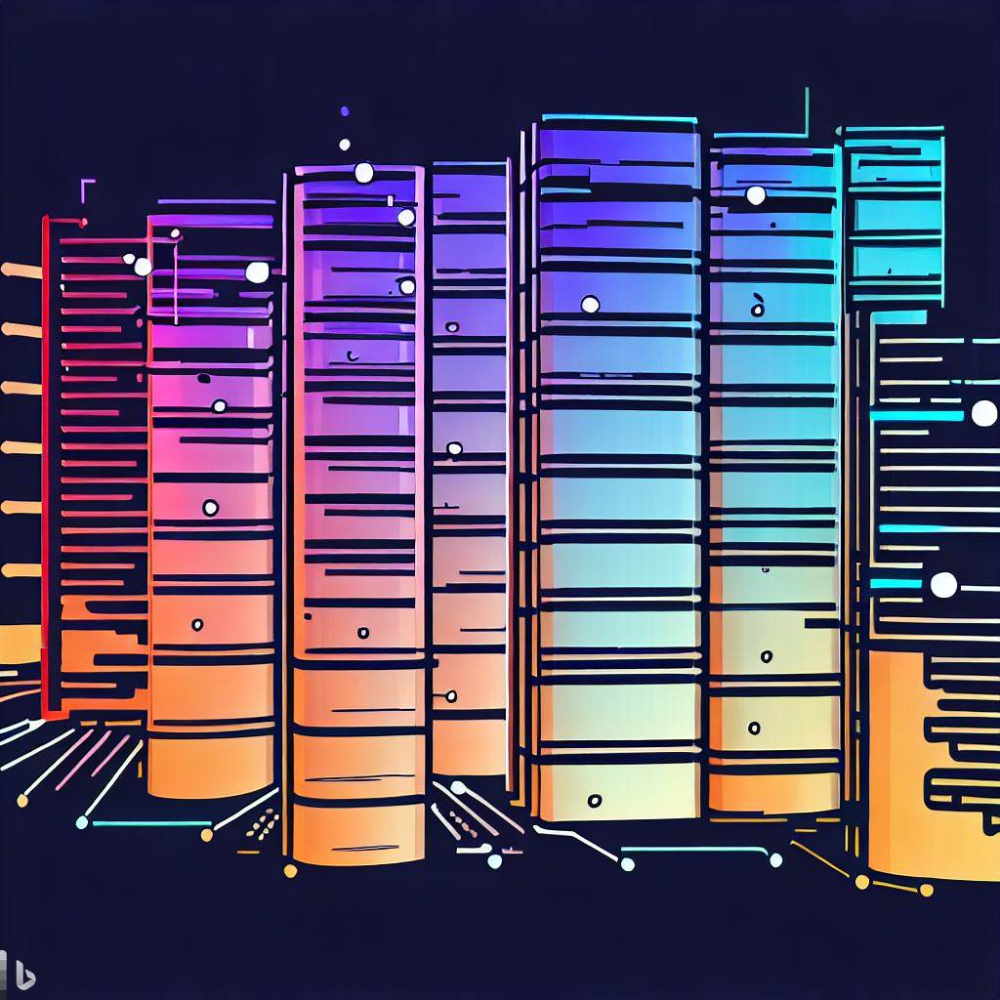

# Data Engineering Pipelines Overview and Cloud Providers
In this lesson, we will explore the fascinating world of data engineering pipelines and how cloud computing has revolutionized the field. We will delve into the benefits of cloud computing for data engineering compared to on-premises servers and examine how data engineering pipelines have evolved with the emergence and accessibility of cloud technologies. By the end of this lesson, you will have a solid understanding of these concepts and their significance in modern data engineering.

## What you will learn
* Benefits of Cloud Computing for Data Engineering
* Cloud and On-Prem comparison
* Evolution of Data Engineering Pipelines with Cloud Computing
* Types of data pipelines

# Benefits of Cloud Computing for Data Engineering:

## Scalability

Scalability is a key benefit of cloud computing for data engineering. With cloud infrastructure, data engineers can seamlessly scale resources up or down based on demand, accommodating fluctuating workloads without significant upfront investments. This enables organizations to handle increasing data volumes and processing requirements efficiently. Cloud service providers like AWS and GCP offer auto-scaling capabilities, ensuring that resources are dynamically adjusted to meet the needs of data engineering pipelines.

In a hypothetical scenario, a data engineering team needs to process and analyze a massive dataset to derive insights for a retail company. With cloud scalability, the team can easily scale up the compute resources to handle the peak loads during seasonal sales or promotions. They can leverage AWS services such as Amazon EMR (Elastic MapReduce) or GCP services like Dataproc to dynamically provision a cluster of compute nodes for distributed data processing. This allows them to efficiently process and analyze the large dataset within a shorter timeframe, enabling the retail company to make data-driven decisions and optimize their business strategies.

___

## Elasticity

Elasticity is another significant advantage of cloud computing for data engineering. Cloud infrastructure allows data engineers to dynamically allocate and adjust resources based on workload requirements. This flexibility ensures that the necessary computing power and storage capacity can be provisioned and scaled in real-time, accommodating varying data processing needs. With elasticity, data engineers can optimize resource utilization, improve performance, and reduce costs by only paying for the resources they actually use.

Consider a data engineering team working on a machine learning project that requires training and inference on large datasets. In this scenario, the team can leverage the elasticity of cloud computing to provision powerful instances for training models on AWS EC2 instances or GCP Compute Engine. Once the models are trained, they can then utilize serverless platforms like AWS Lambda or GCP Cloud Functions for on-demand inference, automatically scaling the number of function instances based on incoming requests. This elasticity allows the team to efficiently handle varying workloads, ensuring optimal performance during peak periods while minimizing costs during idle periods when fewer resources are needed.

___

## Cost Savings

Cost savings is a significant benefit of cloud computing for data engineering. With cloud infrastructure, organizations can avoid upfront hardware investments and reduce maintenance costs associated with on-premises solutions. Cloud providers offer a pay-as-you-go model, where organizations only pay for the resources they consume. This allows data engineers to optimize resource utilization and scale up or down based on demand, eliminating the need for overprovisioning or underutilized hardware. Additionally, cloud services often include managed offerings, reducing the need for manual administration and lowering operational costs.

Let's consider a data engineering team tasked with processing and analyzing streaming data from IoT devices for a smart city project. With cloud cost savings, the team can leverage services such as AWS Kinesis or GCP Pub/Sub to ingest and process the streaming data. By utilizing cloud-based managed services, the team can avoid the cost of setting up and maintaining their own data ingestion infrastructure. They can then use serverless computing platforms like AWS Lambda or GCP Cloud Functions for real-time data processing and analysis, paying only for the compute time consumed. This approach enables the team to achieve significant cost savings by leveraging the scalability and cost-efficient architecture provided by cloud services, without the need for upfront investments in hardware or infrastructure.

___

## High Availability

High availability is a critical benefit of cloud computing for data engineering. Cloud service providers offer robust infrastructure and redundancy mechanisms to ensure that data and applications are highly available. With features such as data replication, automatic backups, and fault-tolerant architectures, organizations can minimize downtime and ensure continuous access to their data and pipelines. Cloud providers like AWS and GCP operate multiple data centers in different geographical regions, offering data engineers the ability to deploy their infrastructure across availability zones for enhanced resilience.

Imagine a data engineering team responsible for maintaining a real-time analytics platform for a global e-commerce company. By leveraging the high availability of cloud services, the team can deploy their data processing pipelines across multiple availability zones using services like AWS Elastic Beanstalk or GCP App Engine. This ensures that even if a specific data center or availability zone experiences an outage, the platform remains accessible and continues to process data. Additionally, they can use managed database services like AWS RDS or GCP Cloud SQL, which automatically handle replication and backups, ensuring data durability and minimizing the risk of data loss. The high availability provided by the cloud enables the team to deliver a reliable and uninterrupted analytics platform to the e-commerce company, ensuring continuous data processing and analysis for business insights.

___

## Global Accessibility

Global accessibility is a key advantage of cloud computing for data engineering. Cloud service providers have a global presence, offering data engineers the ability to access and manage their infrastructure and data from anywhere in the world. With the cloud, data engineers can collaborate seamlessly with geographically dispersed teams, enabling efficient teamwork and knowledge sharing. Additionally, cloud providers offer content delivery networks (CDNs) that cache and distribute data to multiple regions, reducing latency and ensuring fast and reliable access to data regardless of the user's location.

Consider a multinational organization with data engineering teams located in different countries. By leveraging the global accessibility of cloud services, these teams can work collaboratively on data projects, sharing code, pipelines, and datasets across regions. They can use version control systems like GitHub or GitLab to manage their code repositories, allowing for efficient collaboration and code synchronization. Cloud platforms like AWS and GCP provide secure and encrypted connections, ensuring data privacy and access control as teams work together on data engineering tasks. The global accessibility offered by the cloud enables seamless collaboration and efficient data engineering practices for organizations with distributed teams.

___

## Disaster Recovery

Disaster recovery is a crucial aspect of data engineering, and cloud computing provides significant advantages in this area. Cloud service providers offer robust disaster recovery mechanisms that help protect data and ensure business continuity in the event of unexpected disruptions. Organizations can replicate their data and infrastructure across different geographical regions, allowing for data redundancy and failover capabilities. Cloud providers also offer automated backup and restoration services, enabling data engineers to quickly recover from data loss or system failures. These disaster recovery features help minimize downtime, ensure data integrity, and provide peace of mind to data engineering teams.

Imagine a data engineering team responsible for managing critical data pipelines for a financial institution. To ensure disaster recovery, the team can utilize cloud services such as AWS S3 or GCP Cloud Storage to store regular backups of their datasets and pipeline configurations. They can also set up data replication across multiple regions using services like AWS RDS Multi-AZ or GCP Cloud SQL regional replicas. In the event of a disaster or system failure, the team can quickly restore their data and infrastructure, minimizing downtime and ensuring business continuity. Cloud providers also offer additional disaster recovery services, such as AWS Disaster Recovery and GCP Cloud Disaster Recovery, which provide more advanced features and capabilities for comprehensive disaster recovery planning. The cloud's disaster recovery capabilities enable data engineering teams to protect critical data and maintain the availability of their data pipelines, even in the face of unforeseen events.
___

## Rapid Provisioning and Deployment

Rapid provisioning and deployment is a significant advantage of cloud computing for data engineering. Cloud service providers offer automated provisioning and deployment capabilities, enabling data engineers to quickly spin up or down infrastructure resources as needed. With just a few clicks or API calls, data engineers can provision virtual machines, storage systems, and networking configurations, significantly reducing the time and effort required to set up and configure infrastructure. This agility allows data engineering teams to respond rapidly to changing requirements, launch new projects, and scale resources to meet evolving data processing needs.

Imagine a data engineering team tasked with implementing a new data pipeline for a real-time data streaming application. By leveraging the rapid provisioning and deployment capabilities of cloud services, the team can use technologies like AWS Lambda or GCP Cloud Functions to quickly set up event-driven processing logic. These serverless compute services automatically scale resources based on incoming data volume, ensuring efficient and cost-effective processing. The team can also leverage cloud-based messaging services like AWS Kinesis or GCP Pub/Sub for reliable data ingestion and streaming. With the ability to provision and deploy these services rapidly, the team can accelerate the development and deployment of the data pipeline, allowing the application to process streaming data in near real-time.

___

## Automation and Orchestration

Automation and orchestration are crucial aspects of data engineering, and cloud computing offers powerful capabilities in this area. Cloud service providers provide robust automation and orchestration tools that enable data engineers to streamline and manage complex data workflows. These tools allow for the automation of repetitive tasks, such as data ingestion, transformation, and data pipeline execution, reducing manual effort and improving operational efficiency. Data engineers can define and schedule workflows, set up dependencies, and incorporate error handling mechanisms to ensure smooth and reliable execution of data engineering pipelines.

Consider a data engineering team responsible for ingesting data from multiple sources, performing data transformations, and loading it into a data warehouse for analytics. By leveraging cloud automation and orchestration services, such as AWS Step Functions or GCP Cloud Composer, the team can create workflow definitions that automate the entire data pipeline process. They can define tasks, specify their dependencies, and schedule the execution of each step. For example, they can set up automated triggers to start the pipeline when new data arrives in a source system. The workflow can then perform data transformations using AWS Glue or GCP Dataflow and load the transformed data into a data warehouse like AWS Redshift or GCP BigQuery. With automation and orchestration, the team can ensure the timely and accurate execution of the data pipeline while minimizing manual intervention and improving overall productivity.

___

## Integration with Data Services

Integration with data services is a key benefit of cloud computing for data engineering. Cloud service providers offer a wide range of data services and tools that seamlessly integrate with data engineering pipelines, enabling efficient data processing, analytics, and machine learning workflows. These services provide specialized functionality for tasks such as data transformation, data storage, data analysis, and predictive modeling. Data engineers can leverage these services to enhance their data engineering pipelines, improve data quality and reliability, and gain valuable insights from their data.

Let's consider a data engineering team working on a project that involves building a recommendation system for an e-commerce platform. The team can utilize cloud-based data services to enhance their data engineering pipeline. They can use AWS Glue or GCP Dataflow for scalable and efficient data transformations, ensuring that the data is prepared for the recommendation model. They can leverage services like AWS S3 or GCP Cloud Storage for storing and accessing large volumes of data required for training the recommendation model. Additionally, they can utilize machine learning services like AWS SageMaker or GCP AI Platform for model training and deployment. These services provide pre-built algorithms and infrastructure for training and serving machine learning models. By integrating these data services into their pipeline, the team can efficiently process, analyze, and model the data to generate personalized recommendations for the e-commerce platform's users.

___

## Continuous Innovation and Updates

Continuous innovation and updates are inherent benefits of cloud computing for data engineering. Cloud service providers continuously invest in enhancing their offerings and introducing new features and functionalities. Data engineers can leverage these innovations to stay at the forefront of technology and take advantage of the latest tools and capabilities. Cloud providers regularly release updates, security patches, and performance improvements, ensuring that data engineering pipelines are running on the most up-to-date and efficient infrastructure. This continuous cycle of innovation and updates allows data engineers to adapt to evolving industry trends, leverage new technologies, and improve the overall effectiveness and efficiency of their data engineering workflows.

Consider a data engineering team working on a data processing pipeline for a financial services organization. The team can take advantage of the continuous innovation and updates offered by cloud providers like AWS and GCP. They can leverage services like AWS Glue or GCP Dataflow, which provide automatic updates and improvements to their data transformation capabilities. Additionally, they can benefit from the latest advancements in machine learning by utilizing AWS SageMaker or GCP AI Platform, which receive regular updates and introduce new algorithms and model deployment options. By embracing continuous innovation and updates, the team can ensure that their data engineering pipeline remains at the cutting edge of technology, enabling them to deliver high-quality, efficient, and future-proof solutions for their organization's data processing needs.

___

## Collaboration and Teamwork

Cloud computing enables seamless collaboration and teamwork among data engineering teams. Cloud service providers offer a range of collaborative tools and features that facilitate efficient communication, sharing of resources, and joint problem-solving. Data engineers can work together in real-time, regardless of their geographical locations, making it easier to collaborate on complex data engineering projects. Cloud-based platforms provide shared access to code repositories, documentation, and version control systems, enabling teams to work collaboratively and maintain a centralized knowledge base. This enhanced collaboration fosters innovation, accelerates project timelines, and promotes effective knowledge sharing among team members.

Imagine a data engineering team distributed across different locations, working on a data integration project for a multinational company. By leveraging cloud-based collaboration tools such as AWS CodeCommit or GCP Cloud Source Repositories, team members can securely collaborate on code development and version control. They can use communication platforms like AWS Chime or GCP Hangouts to conduct virtual meetings, share screens, and discuss project requirements and progress in real-time. Additionally, cloud-based project management tools like AWS CloudFormation or GCP Cloud Deployment Manager can help streamline task assignment, track project milestones, and monitor progress. This collaborative environment enables the team to work seamlessly together, leveraging each other's expertise and ensuring efficient project execution, regardless of their physical locations.

___

## Monitoring and Logging

Monitoring and logging are critical aspects of data engineering, and cloud computing offers robust solutions to facilitate effective monitoring and logging of data engineering pipelines. Cloud service providers offer comprehensive monitoring and logging services that enable data engineers to track the health, performance, and behavior of their pipelines in real-time. These services provide valuable insights into resource utilization, data throughput, and potential bottlenecks, allowing data engineers to identify and resolve issues quickly.

Monitoring tools provided by cloud platforms, such as AWS CloudWatch or GCP Stackdriver, offer customizable dashboards, alerts, and metrics to monitor the various components of data engineering pipelines. Data engineers can set up automated notifications and alerts to proactively detect anomalies, performance degradation, or system failures, enabling prompt troubleshooting and resolution.

Logging services, such as AWS CloudTrail or GCP Cloud Logging, capture and store detailed logs of activities and events within the data engineering environment. These logs provide an audit trail of operations, allowing data engineers to trace issues, troubleshoot errors, and gain insights into system behavior. Data engineers can use log analytics and search capabilities to query and analyze logs for troubleshooting, performance optimization, and compliance purposes.

Let's consider a data engineering team responsible for processing and analyzing large volumes of customer data for an e-commerce company. By leveraging cloud-based monitoring and logging services, such as AWS CloudWatch and AWS CloudTrail or GCP Stackdriver and GCP Cloud Logging, the team can monitor the performance and health of their data pipelines. They can set up custom dashboards to visualize metrics like data ingestion rates, processing time, and resource utilization. In case of any anomalies or performance issues, they can receive real-time alerts to take proactive action. The team can also analyze the logs generated by the pipelines to trace and troubleshoot any errors or investigate suspicious activities. This comprehensive monitoring and logging capability ensures the reliability, performance, and security of the data engineering pipelines, helping the team maintain a high-quality data processing infrastructure.

___

## Regulatory Compliance

Regulatory compliance is a crucial consideration for data engineering, especially in industries that handle sensitive or personally identifiable information (PII). Cloud computing offers various features and services to help data engineers ensure regulatory compliance and meet industry-specific requirements.

Cloud service providers, such as AWS and GCP, have implemented stringent security measures and certifications to comply with industry standards and regulations, such as GDPR, HIPAA, and PCI DSS. These providers offer a shared responsibility model, where they take care of the security of the underlying cloud infrastructure, while data engineers are responsible for securing their applications and data within the cloud.

Cloud platforms provide a range of security services and features, including data encryption, access controls, identity and access management (IAM), and audit logs, to help data engineers protect and secure their data. These services enable data engineers to implement granular access controls, manage user permissions, encrypt data at rest and in transit, and track and monitor access to sensitive information.

Moreover, cloud providers offer compliance-oriented services, such as AWS Artifact and GCP Compliance, which provide access to compliance reports, certificates, and other documentation required for audits and regulatory assessments. These services streamline the process of demonstrating compliance to auditors and regulatory bodies, helping data engineers meet the necessary compliance requirements with ease.

Let's consider a data engineering team working for a healthcare organization that processes patient data. To ensure regulatory compliance with HIPAA, the team can leverage the security and compliance features provided by cloud platforms like AWS and GCP. They can use encryption services, such as AWS Key Management Service (KMS) or GCP Key Management Service (KMS), to encrypt sensitive data at rest and in transit. The team can implement fine-grained access controls using IAM services, ensuring that only authorized personnel have access to the data.

Furthermore, they can configure audit logs and monitoring services, such as AWS CloudTrail or GCP Cloud Audit Logs, to track and log access to patient data, facilitating compliance reporting and monitoring. Cloud platforms also offer compliance documentation and resources, such as AWS Artifact and GCP Compliance, which provide the necessary compliance reports and certifications required for HIPAA audits.

By utilizing the security features and compliance-oriented services provided by cloud providers, the data engineering team can maintain regulatory compliance, protect patient data, and confidently meet the stringent requirements of the healthcare industry.

# Cloud and On-prem comparison

| Pros                                  | On-Premises Infrastructure                  | Cloud Computing                                      |
|---------------------------------------|--------------------------------------------|------------------------------------------------------|
| Scalability                           | Limited scalability due to fixed resources | Highly scalable with on-demand resource provisioning |
| Cost Savings                          | Potential higher upfront costs              | Lower upfront costs with pay-as-you-go pricing       |
| Maintenance and Management            | Full control over infrastructure           | Outsourced maintenance and management responsibilities |
| High Availability                     | Dependent on local infrastructure          | High availability and redundancy built into the cloud |
| Global Accessibility                 | Limited access from specific locations     | Global access from anywhere with an internet connection |
| Disaster Recovery                     | Requires dedicated disaster recovery plan  | Built-in disaster recovery mechanisms and options    |
| Flexibility in Infrastructure         | Fixed infrastructure and limited flexibility | Easily adaptable infrastructure to meet changing needs |
| Rapid Provisioning and Deployment     | Longer lead times for resource provisioning | Instant provisioning and fast deployment of resources |
| Automation and Orchestration          | Manual configuration and management        | Automated processes and orchestration capabilities |
| Integration with Data Services        | Limited integration options                 | Seamless integration with various data services      |
| On-Demand Resource Provisioning       | Limited resource provisioning flexibility  | On-demand allocation and release of resources        |
| Continuous Innovation and Updates     | Dependent on internal updates and upgrades  | Continuous updates and access to latest technologies |
| Collaboration and Teamwork            | Limited collaboration across locations     | Enhanced collaboration and teamwork capabilities   |
| Monitoring and Logging                | Custom monitoring and logging setup         | Built-in monitoring and logging tools and services  |
| Regulatory Compliance                 | Full control over compliance measures      | Compliance certifications and tools provided by cloud platforms |

# Evolution of Data Engineering Pipelines with Cloud Computing

Let's explore the transformation of data engineering, from on-premises infrastructure to the cloud, and its impact on data warehouses, databases, data pipelines, and the rise of ELT.

In the past, data engineering revolved around on-premises solutions where organizations built and managed their own data centers. These data centers housed data warehouses and databases, serving as the backbone of data processing.

However, as technology advanced and data processing needs grew, scaling on-premises infrastructure became challenging. Organizations struggled to accommodate increasing data volumes and processing requirements, necessitating a new approach.

The emergence of cloud computing presented a transformative alternative. Cloud service providers offered virtually unlimited scalability, elasticity, and flexibility, allowing organizations to leverage these advantages.

Cloud-based data warehouses provided the ability to scale storage and compute resources on-demand. This scalability allowed data engineers to handle vast amounts of data seamlessly, accommodating fluctuating workloads without substantial upfront investments.

Cloud-based databases also underwent significant changes. Managed database services eliminated manual database administration tasks, offering high availability, automatic backups, and built-in replication. This shift reduced the burden on data engineers, enabling them to focus on extracting insights from the data.

In the on-premises world, data transformations occurred before loading data into the warehouse, resulting in delays and resource-intensive operations. However, the cloud's elasticity and computational power revolutionized this approach.

In the cloud era, data engineers could load raw, unprocessed data directly into cloud-based data warehouses. This change facilitated quick ingestion and storage of large volumes of data in its raw format. Data transformations and analysis could then be performed directly within the database using powerful distributed computing resources.

The cloud had a profound impact on modern data architecture, enabling the integration of diverse structured and unstructured data sources across organizations. Cloud-based storage services, such as object storage and data lakes, offered cost-effective options for storing and accessing massive volumes of raw data.

The shift to ELT provided multiple advantages. It reduced the time and effort required for data preprocessing, allowing data engineers to focus on extracting insights and value from the data. Moreover, it enabled agile and iterative data processing, allowing engineers to refine and adjust transformations as requirements emerged or data evolved.

Scalability and on-demand resource provisioning capabilities in the cloud transformed data engineering pipelines. Data engineers could dynamically scale resources based on workload requirements, efficiently handling varying data volumes and processing needs. This elasticity ensured pipelines could adapt to peak loads during high-demand periods and scale back during quieter periods, optimizing resource utilization and reducing costs.

The cloud also brought new possibilities for pipeline orchestration and automation. Cloud-based services and tools provided automation and orchestration capabilities, simplifying the design and management of complex workflows. Scheduling, dependency management, error handling, and monitoring became more efficient and reliable, ensuring streamlined execution of data engineering pipelines.

Additionally, the cloud's integration with various data services and tools expanded the horizons of data engineering pipelines. Data engineers gained access to a rich ecosystem of data processing, analytics, and machine learning services, leveraging specialized tools for specific tasks within the pipeline. This integration facilitated the seamless flow of data between services, enabling end-to-end data processing and analysis workflows.

In conclusion, the evolution from on-premises infrastructure to the cloud has revolutionized data engineering. The scalability, elasticity, and flexibility of the cloud have reshaped data warehouses, databases, and data pipelines. This shift, coupled with the emergence of ELT, has propelled modern data architecture into new frontiers. Data engineers now have the power to drive innovation, uncover valuable insights, and guide organizations on their data-driven journey.

# Types of data pipelines
Data pipelines play a crucial role in data engineering by enabling the efficient and reliable flow of data from various sources to its destination for processing, analysis, and storage. A data pipeline consists of a series of interconnected processes and operations that extract, transform, and load (ETL) data to create a unified and usable dataset. With the advent of cloud computing, data pipelines have undergone significant transformations, leveraging the benefits offered by cloud services and technologies.

In the cloud, data pipelines benefit from the scalability, flexibility, and automation capabilities provided by cloud platforms. Cloud-based data pipelines can handle large volumes of data, accommodate variable workloads, and automatically scale resources as needed. They can be designed to ingest data from diverse sources, such as databases, applications, streaming platforms, and external APIs.

## ETL
ETL pipelines involve extracting data from multiple sources, applying transformations to cleanse, aggregate, and structure the data, and loading it into a target system or data warehouse. In an ETL pipeline, data is typically transformed before loading, ensuring that the target system receives clean and organized data. Cloud services like AWS Glue and Google Cloud Dataflow provide ETL capabilities for building and managing these pipelines.

___

## ELT
ELT pipelines differ from ETL pipelines in terms of the sequencing of data processing steps. In an ELT pipeline, data is first extracted from source systems and loaded into a target storage, such as a data lake or a cloud-based data warehouse. The transformations are then applied to the data within the target storage, taking advantage of the computing power and scalability offered by the cloud. Services like AWS Glue, Google Cloud Dataflow, and Snowflake support ELT pipelines.

___

## Machine Learning
Data pipelines for machine learning involve the extraction, preprocessing, and transformation of data to train and deploy machine learning models. These pipelines encompass tasks such as data collection, feature engineering, model training, evaluation, and deployment. Cloud platforms like AWS and Google Cloud offer a range of services, such as AWS SageMaker and Google Cloud AI Platform, specifically designed for building end-to-end machine learning pipelines.

___

## Analytics
Analytics pipelines focus on processing and analyzing data to derive insights and support decision-making. These pipelines involve data extraction from various sources, data transformation, aggregation, and loading into analytics tools or data visualization platforms. Cloud services like AWS Glue, Google Cloud Dataflow, and BigQuery are commonly used in building analytics pipelines.