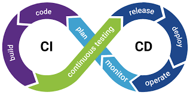

# CI/CD Pipeline Creation - Introduction

In this practice you will learn the basics of what is Continuous Integration and Continuous Delivery. We will have an overview of the process and how to implement it using Github Actions. 

## What you will learn

- What is CI/CD
- Github Actions script configuration basics
  - Resources
  - Variables
  - Dependencies
  - Outputs
- What is a container
- Docker and Kubernetes configuration basics
For an introduction to the core concepts behind GitHub Actions, I recommend reading [this article](https://www.padok.fr/en/blog/github-actions).

## Pre-requisites

- A Github account. No paid plan is necessary.

- Basic knowledge of git and Github: how to commit changes to branches and open pull requests.

- A [DockerHub](https://hub.docker.com/) account. Alternatively, you can use any public container registry.

- A working Kubernetes cluster. You must have the [`kubectl`](https://kubernetes.io/docs/tasks/tools/install-kubectl/)
  command-line tool configured with administrator-level previleges on your cluster. A [Google Kubernetes Engine](https://cloud.google.com/kubernetes-engine) cluster will work perfectly.

## Introduction

In this practice you will learn how to build a functional CI/CD pipeline with Github Actions. You will create a workflow that automatically runs unit tests on all pull requests, and deploys the latest version of the master branch to a Kubernetes cluster.



## Practice

### Continuous Integration and Continuous Delivery (CI/CD)

CI/CD is a set of processes which aim to help teams ship software quickly and reliably.

Continuous integration (CI) checks automatically verify that all changes to your code work as expected, and typically run before the change is merged into your Git master branch. This ensures that the version of the code on the master branch always works correctly.

Continuous deployment (CD) tools automatically (and frequently) deploy the latest version of your code to production. This is intended to minimize the time it takes for new features or bugfixes to be available in production.

GitHub Actions is a task automation system fully integrated with GitHub.

#### Step 0: Clone this repository

The first thing you should do is clone [https://] this repository.

This repository contains code for a simple HTTP server. Here is a quick tour of the files already in place. Feel free to take a deeper look at the code if you are interested.

The `go.mod`, `main.go` files and `foobar/` directory implement a rudimentary HTTP server, complete with unit tests. The server has two endpoints: `/foobar`, which responds with a FooBar sequence, and `/healthz`, which reports on the server's health.

A `Dockerfile` provides a recipe for compiling the Go code into a container image.

The `manifests/` directory contains Kubernetes resource specifications and a [Kustomize](https://kustomize.io/) configuration file.

### Testing

A good practice in every CI pipeline is to run unit tests on all pull requests and on every commit to the master branch. Since tests in general are not the scope of this tutorial, we are not covering how to create them. But the main tests usually covered in a CI pipeline are:

1. Unit Testing
Unit testing is a method of testing individual units or components of a software application. It is typically done by developers and is used to ensure that the individual units of the software are working as intended. Unit tests are usually automated and are designed to test specific parts of the code, such as a particular function or method. Unit testing is done at the lowest level of the software development process, where individual units of code are tested in isolation.

2. Integration Testing
Integration testing is a method of testing how different units or components of a software application interact with each other. It is used to identify and resolve any issues that may arise when different units of the software are combined. Integration testing is typically done after unit testing and before functional testing, and is used to verify that the different units of the software work together as intended.

3. System Testing
System Testing is carried out on the whole system in the context of either system requirement specifications or functional requirement specifications or in the context of both. The software is tested such that it works fine for the different operating systems. It is covered under the black box testing technique. In this, we just focus on the required input and output without focusing on internal working. 

#### Exercise

To get started with GitHub Actions let's create our first Workflow Configuration YAML file.

Create a `.github/workflows/workflow.yml` file in your repository for your GitHub Actions **workflow**. In the file, start with a name:

```yaml
name: main-worklfow
```

Use the `on` field to trigger your workflow whenever a commit is pushed to the master branch or a pull request is made:

```yaml
on:
  push:
    branches:
      - master
  pull_request:
    branches:
      - master
```

A workflow is composed of independent **jobs**. Create a job called `run-tests` that will run the application's unit tests:

```yaml
jobs:
  # Run all unit tests.
  run-tests:
```

Every job requires an operating system to run on. For this tutorial, you will be using Ubuntu. Fill in the `runs-on` field of the job:

```yaml
jobs:
  # Run all unit tests.
  run-tests:
    runs-on: ubuntu-latest
```

Jobs contain a list of **steps**, which are executed consecutively. Often, the first step is to clone your repository to use the source code it contains. To do this, use an **action** provided by Github, called `actions/checkout`. To use this action, fill in the `uses` field of the first step:

```yaml
jobs:
  # Run all unit tests.
  run-tests:
    runs-on: ubuntu-latest
    steps:
      # Check out the pull request's source code.
      - name: Check out source code
        uses: actions/checkout@v3
```

Next, you need to have Go installed to run your unit tests. There is already an action that sets up everything for you, called `actions/setup-go`. This action takes a `go-version` parameter, to know which version of Go to install. Provide parameters to an action by filling in the `with` field:

```yaml
steps:
  # Check out the pull request's source code.
  - name: Check out source code
    uses: actions/checkout@v2

  # Install Go.
  - name: Set up Go
    uses: actions/setup-go@v3
    with:
      go-version: "^1.14" # The Go version to download and use.
```

In the code above, `^1.14` means `1.14.x`, where `x` can be anything. Each `1.14.x` release of Go is compatible with your code, so this is not an issue. That being said, it would be nice to know exactly which version of Go you are using here. Print the version in the next step. There is no existing action that does this, so use the `run` field to execute the `go version` command:

```yaml
# Install Go.
- name: Set up Go
  uses: actions/setup-go@v3
  with:
    go-version: "^1.14" # The Go version to download and use.
- name: Print Go version
  run: go version
```

The `run` field allows you to run any shell command. Use it again in the job's final step to run your application's unit tests:

```yaml
# Run unit tests.
- name: Run unit tests
  run: go test -v ./...
```

At this point, you should have the following code for your workflow:

```yaml
name: main-worklfow

env: {}

on:
  push:
    branches:
      - master
  pull_request:
    branches:
      - master

jobs:
  # Run all unit tests.
  run-tests:
    runs-on: ubuntu-latest
    steps:
      # Check out the pull request's source code.
      - name: Check out source code
        uses: actions/checkout@v3

      # Install Go.
      - name: Set up Go
        uses: actions/setup-go@v3
        with:
          go-version: "^1.14" # The Go version to download and use.
      - name: Print Go version
        run: go version

      # Run unit tests.
      - name: Run unit tests
        run: go test -v ./...
```

Commit these changes and push them to the master branch:

```bash
git checkout master
git pull
git add .github/workflows/workflow.yml
git commit -m 'Add run-tests job to workflow'
git push
```

#### Check workflow results

When you pushed your commit to Github, it automatically triggered the workflow. On your repository's page, go to the **Actions** tab. You should see the run in question.

If it is still running, it will have a yellow dot next to your commit message. Once it has finished, depending on the result it will have either a red cross or a green tick. For this first run, the unit tests should pass and the workflow should complete successfully.

#### Create a pull request

Your workflow not only triggers when commits are pushed to master, but also when developers make pull requests. Check out a new branch called `awesome-feature`:

```bash
git checkout -b awesome-feature
```

Edit the `foobar/foobar.go` file to introduce a breaking change. For instance, replace a `5` with a `7`. Then, commit and push the change to Github:

```bash
git add foobar/foobar.go
git commit -m 'Introduce breaking change'
git push -u origin awesome-feature
```

Go to your repository's webpage and create a pull request for the new branch. Once the pull request is created, the workflow will trigger and Github will display its progress on the pull request's page.

Since you introduced a breaking change, the unit tests are failing and your workflow as well. Github displays this prominently, so developers are aware of the issue as soon as possible.

Fix the issue in `foobar/foobar.go`, then commit and push the fix:

```bash
git add foobar/foobar.go
git commit -m 'Fix breaking change'
git push
```

Once the push is through, Github will trigger the workflow again. This time, it will pass.

You can merge your pull request into the master branch, confident that your awesome feature does not introduce a breaking change.

